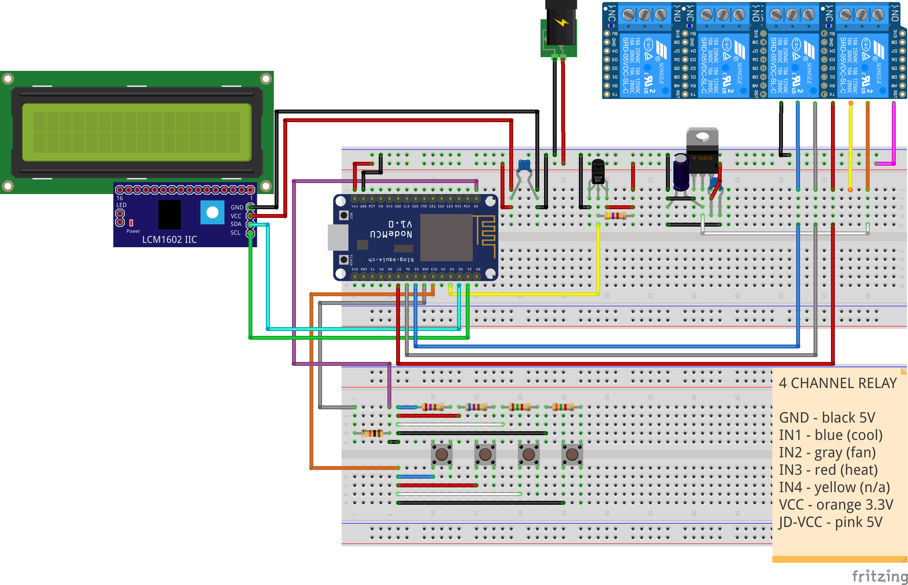

# Fermentation Temperature Controller

Work in Progress

This application and hardware setup provides a means to
control cooling, heating, and ventilation with an
insulated fermentation control chamber such as a small fridge.

## Hardware

* NodeMCU v1.0
* 20x4 I2C LCD
* 4 Channel opto-isolated relay block
* DS18B20 waterproof temperature sensors x2
* Push buttons x4
* 5V wall adapter
* Female barrel power jack
* LD1117V33 voltage regulator
* Various capacitors, resistors, and wiring

## Usage

By default, the chamber temperature sensor, cooling system, 
and heating system are enabled.  The cooling and heating
systems may be enabled/disabled indepenedently.  If enabled,
the thermowell temperature sensor becomes the system's 
operating input, the chamber sensor will still give it's
readings.

## Future plans

* Connect system to WIFI
* Provide control via http
* Enable flightrecorder for analytics
* Operate with premade control schedules

## Author

Andrew Wanex

## License
[MIT](https://github.com/ARW2705/Fermentation-Control/blob/master/LICENSE)
